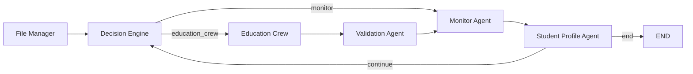
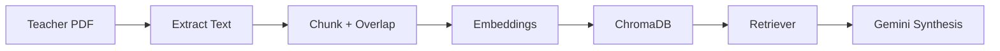

## State Diagrams

LangGraph flow:

```mermaid
flowchart LR
  FM["File Manager"] --> DE["Decision Engine"]
  DE -->|education_crew| EC["Education Crew"]
  DE -->|monitor| MO["Monitor Agent"]
  EC --> VA["Validation Agent"]
  VA --> MO
  MO --> SP["Student Profile Agent"]
  SP -->|continue| DE
  SP -->|end| END["END"]
```

RAG pipeline:

```mermaid
flowchart LR
  PDF["Teacher PDF"] --> EX["Extract Text"]
  EX --> CH["Chunk + Overlap"]
  CH --> EMB["Embeddings"]
  EMB --> DB["ChromaDB"]
  DB --> RET["Retriever"]
  RET --> LLM["Gemini Synthesis"]
```
